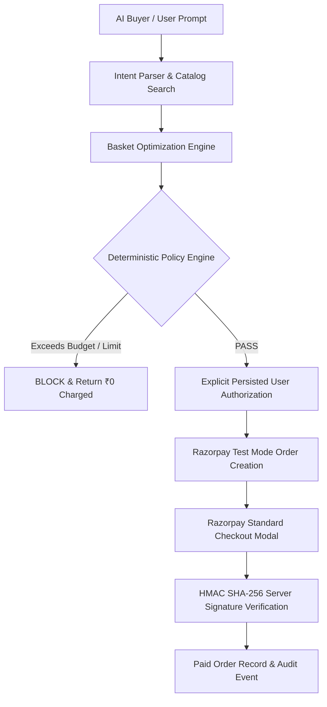

# RAY — AI Revenue & Commerce Operating System

> **Turn every merchant into an AI-native storefront.**
> Built for the Razorpay AI Buildathon.

---

## 🚀 Problem & Vision

Traditional e-commerce storefronts were built for human buyers clicking through Web 2.0 visual pages. As autonomous **AI Buyers** emerge to shop on behalf of users, merchants lack:
1. **Machine-Readable Storefront Contracts** (AI agents cannot discover products or capabilities safely).
2. **Autonomous Revenue Optimization** (Merchants miss high-intent upsell & cross-sell opportunities).
3. **Deterministic Financial Guardrails** (LLMs hallucinate prices or attempt direct payment calls).

**RAY (Razorpay Autonomous Yield)** bridges this gap by turning merchants into machine-readable, revenue-optimized, and safely transactable businesses.

---

## 🏛️ Core Architecture & Security Boundary



### Central Financial Security Principle
> **THE AI CAN RECOMMEND. THE AI CAN REQUEST. THE POLICY ENGINE DECIDES. THE USER AUTHORIZES. RAZORPAY EXECUTES.**

- The LLM **never** touches money, accesses secrets, alters policy limits, or calls Razorpay directly.
- All product prices are fetched server-side from SQLite DB entries. Client price payloads are strictly ignored.
- All payment transactions execute exclusively through server-side Razorpay Test Mode SDK endpoints with HMAC-SHA256 signature verification.

---

## 🌟 5 Core System Hubs

1. **Command Center (`/dashboard`)**: Executive revenue dashboard featuring GMV, AI-attributed lift, active opportunities, AI Commerce Readiness (92/100), and an actionable intelligence feed.
2. **Revenue Agent (`/agent`)**: Autonomous growth operator featuring 3 distinct revenue engines:
   - *Engine 01 (Upsell)*: Recommends higher-tier performance models.
   - *Engine 02 (Cross-Sell Graph)*: Recommends complementary attachments based on historical purchase co-occurrence.
   - *Engine 03 (Campaign Orchestrator)*: Modeled deterministic campaign revenue impact formula.
3. **AI Buyer Console (`/buyer`)**: Natural-language intent search ("Find me the best running setup"), candidate search, basket optimization (₹4,498 total), explicit user authorization modal, and Razorpay checkout launch. The AI Buyer searches unconstrained by price caps; financial execution limits (₹5,000 single cap, ₹20,000 daily spend) are deterministically enforced by the Policy Engine.
4. **AI Commerce Passport (`/passport`)**: Machine-readable merchant discovery contract exposed versioned at `GET /api/agent/merchant/nova-run` with Zod schema validation and a Live Machine JSON Inspector.
5. **Transaction Safety (`/resilience`)**: Explicit 11-stage Transaction State Machine, 100/100 Safety Score, idempotency protection, and guided failure simulations.

---

## ⚡ Guided 3-Minute Judge Demo Sequence

| Step | Time | Hub | Action & Highlight |
|---|---|---|---|
| **Step 1** | 20s | Command Center | Executive revenue overview & 92/100 AI Commerce Readiness score. |
| **Step 2** | 25s | Revenue Agent | Cross-sell graph: Nova Runner X1 Pro $\rightarrow$ Anti-Blister Socks (42% attach rate). |
| **Step 3** | 35s | AI Buyer | Query: *"Find me the best running setup"*. Basket optimized to ₹4,498. |
| **Step 4** | 20s | Policy Gate | Policy Engine verifies ₹4,498 $\le$ ₹5,000 cap $\rightarrow$ PASS. Explicit user consent modal. |
| **Step 5** | 30s | Razorpay Checkout | Launch official Razorpay Test Checkout modal. HMAC SHA-256 signature verified server-side. |
| **Step 6** | 20s | Failure Simulation | Rapid double click simulation: Idempotency returns original transaction with ₹0 duplicate charge. |
| **Step 7** | 20s | Commerce Passport | Live Machine JSON Inspector fetching actual `GET /api/agent/merchant/nova-run` contract. |
| **Step 8** | 10s | Pitch Summary | *"AI Discovery + Revenue Intelligence + Bounded Payments = AI-Ready Merchant."* |

---

## 🛡️ Failure & Resilience Matrix

| Failure Scenario | Server Response | Money Charged | Recovery Strategy |
|---|---|---|---|
| Single Transaction Cap Breach | `LIMIT_EXCEEDED` | **₹0** | Reduce basket amount $\le$ ₹5,000 |
| Rapid Double Click | `DUPLICATE_REQUEST` | **₹0** | Reuse existing transaction state |
| Simulated Card Decline | `PAYMENT_FAILED` | **₹0** | Safe retry with alternate card |
| Gateway Timeout | `PAYMENT_TIMEOUT` | **₹0** | Check status; no blind retry |
| HMAC Signature Mismatch | `SIGNATURE_INVALID` | **₹0** | Reject payment & log security alert |
| AI Service Outage | `AI_OUTAGE_FALLBACK` | **₹0** | Switch to deterministic buyer engine |
| Price Tampering (₹1 attempt) | `PRICE_TAMPERING_BLOCKED` | **₹0** | Server restores canonical DB price (₹3,999) |

---

## 🧪 Automated Test Suite & Verification Results

```bash
cmd.exe /c "npx.cmd vitest run"
```

```text
 RUN  v2.1.9 C:/Users/hitma/OneDrive/Desktop/Razorpay

 ✓ __tests__/phase1.test.ts (5 tests)
 ✓ __tests__/passport.test.ts (4 tests)
 ✓ __tests__/razorpay.test.ts (7 tests)
 ✓ __tests__/resilience.test.ts (6 tests)
 ✓ __tests__/policy.test.ts (7 tests)
 ✓ __tests__/buyer.test.ts (7 tests)
 ✓ __tests__/agent.test.ts (8 tests)

 Test Files  7 passed (7)
      Tests  44 passed (44)
   Duration  1.52s
```

---

## 🛠️ Local Development & Quickstart

```bash
# 1. Install dependencies
npm install

# 2. Initialize database schema & seed Nova Run merchant
npx prisma db push
npx prisma db seed

# 3. Execute test suite
npx vitest run

# 4. Start Next.js dev server
npm run dev
```

Server will start on `http://localhost:3000`.

---

## 📄 License & Credentials Policy

- Razorpay Test Mode Credentials are stored in `.env.local`.
- `RAZORPAY_KEY_SECRET` is strictly server-side and never exposed to the browser or committed to version control.
